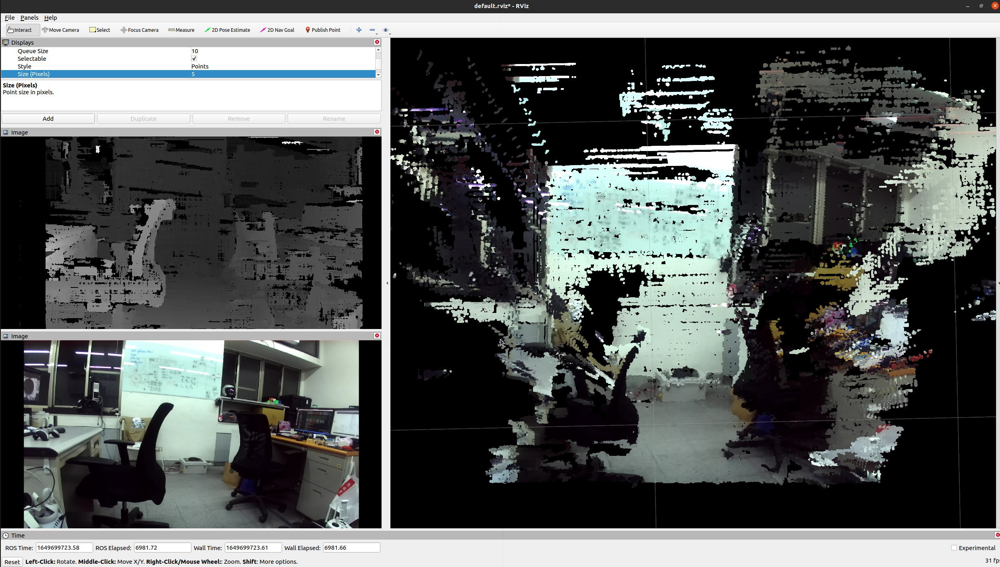

# zed-ros-wrapper-without-cuda

## Description
This package lets you use the ZED stereo camera with ROS. Compared to the [official package](https://github.com/stereolabs/zed-ros-wrapper), this package doesn't require CUDA.

It outputs the camera left and right raw images(`sensor_msgs/Image`), depth image(`sensor_msgs/Image`) and colorful point cloud(`sensor_msgs/PointCloud2`), point cloud with frame_id `zed_mini`.

Tested on `Ubuntu 20.04` & `ROS noetic` with `ZED mini`.

Part of code modify from [ZED Open Capture](https://github.com/stereolabs/zed-open-capture).

## Install prerequisites
`$ sudo apt install -y build-essential
                      cmake
                      libusb-1.0-0-dev libhidapi-libusb0 libhidapi-dev
                      libopencv-dev libopencv-viz-dev`

## Run
`$ mkdir -p catkin_ws/src && cd catkin_ws/src`

`$ git clone git@github.com:Yelloooowww/zed-ros-wrapper-without-cuda.git`

`$ cd ..`

`$ catkin_make`

`$ source devel/setup.bash`

`$ rosrun zed_ros_without_cuda anyzed_ros_node`

